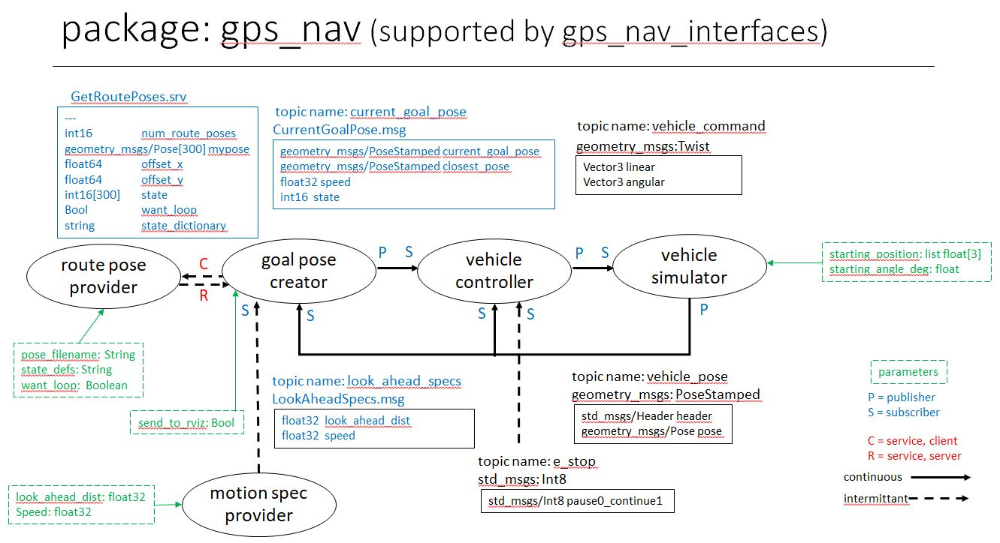

# gps_nav
The following figure depicts all the nodes, topics, and messages that are used in the gps_nav package.

### Information
- Nodes are shown in ellipses.
- Topics are shown using lines with arrows.
- The messages used for each topic are shown.  Black text is used for standard messages.  Blue text is used for custom interface messages that are in the package *gps_nav_interfaces*.
- Parameters are shown in green.
- The launch file *launch/launch_gps_0.py* starts all the nodes.  The parameter values can be set in the launch file.  If the rviz2 configuration file does not load correctly, when in rviz2, load the configuration file *rviz/bandshell_1_rviz.rviz*.
- The vehicle_controller node is using an algorithm where a third order path is generated to move from the current vehicle pose to the current goal pose.  The radius of curvature at the start of this path is used to generate the motion twist to send to the vehicle.
- The vehicle speed is in units of meters per frame.  Since the vehicle simulator node is updating at a rate of 10 Hz, the vehicle speed parameter is in units of meters per 0.1 seconds.  The launch file sets the speed parameter at 0.2 which is equivalent to asking for the vehicle to move at 2 m/sec.

### How to run.
- Create a development workspace by typing *mkdir <your_dev_ws>* when in your home directory. Move into this directory and create a *src* directory.  Move into the *src* diretory.
- Download the repository.
    - git clone https://github.com/av-mae-uf/eml4930_gps_nav.git
    - This will give you two packages, i.e. *gps_nav* and *gps_nav_interfaces*.
- Change your directory to your development workspace directory.  Type *colcon build* . 
- Source your workspace by typing *source install/setup.bash* while in your development workspace directory.
- Change to the launch file directory *cd ~/<your_dev_ws>/src/eml4930_gps_nav/gps_nav/launch*.  Run the launch file, i.e. *ros2 launch ./launch_gps_0.py* .